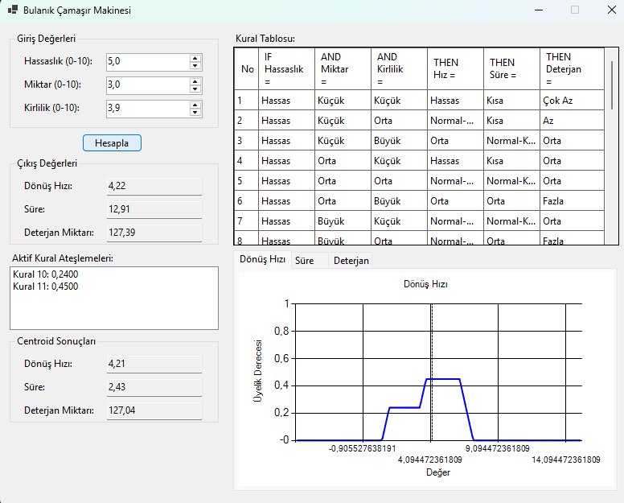

# SmartWash AI - Fuzzy Logic Washing System

Çamaşır makineleri için bulanık mantık tabanlı akıllı optimizasyon sistemi. Çamaşırın özelliklerine göre optimal ayarları otomatik hesaplıyor.

## 🚀 Özellikler
- 27 uzman kuralı ile akıllı karar verme
- Gerçek zamanlı görselleştirme grafikleri  
- Çift durulaştırma yöntemi (Ağırlıklı Ortalama + Centroid)
- Interaktif kural tablosu ve ateşleme takibi

## 🎯 Giriş Parametreleri
- **Hassaslık** (0-10): Kumaş dayanıklılığı
- **Miktar** (0-10): Çamaşır miktarı
- **Kirlilik** (0-10): Kirlilik seviyesi

## 📊 Çıkış Sonuçları
- **Dönüş Hızı**: Optimal devir (RPM)
- **Süre**: İdeal yıkama süresi (dakika)
- **Deterjan**: Gerekli deterjan miktarı (ml)
